## dbt Integration

The warehouse transformation layer was migrated into dbt to simulate a modern analytics engineering workflow.

dbt is used for:

- SQL transformation orchestration
- dependency management
- warehouse testing
- documentation generation
- lineage tracking

The project uses dbt with DuckDB to create:

- staging models
- dimension models
- fact tables
- analytics marts

This architecture follows a modern ELT-style analytics engineering workflow.


## dbt Warehouse Models

The warehouse models are separated into multiple layers.

### Dimension Models

#### Customer Dimension

Stores unique customer entities used by the fact table.

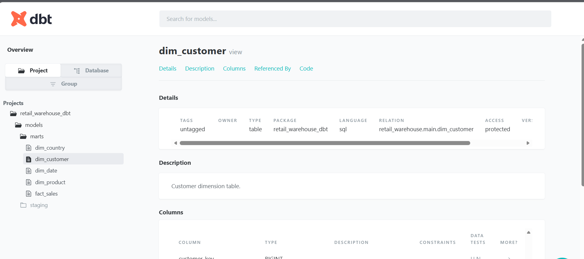

---

#### Product Dimension

Stores product-level attributes and identifiers.

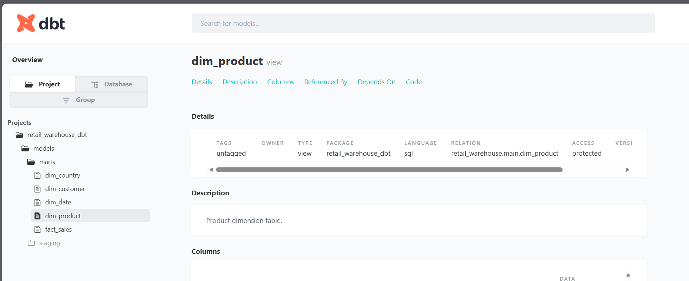

---

#### Country Dimension

Stores country-level geographic information.

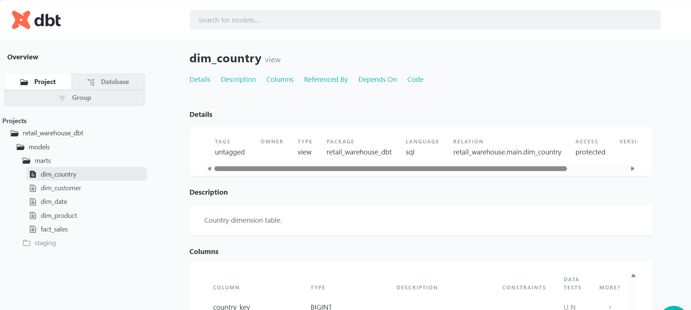

---

#### Date Dimension

Stores date hierarchy information for analytics and time-series reporting.

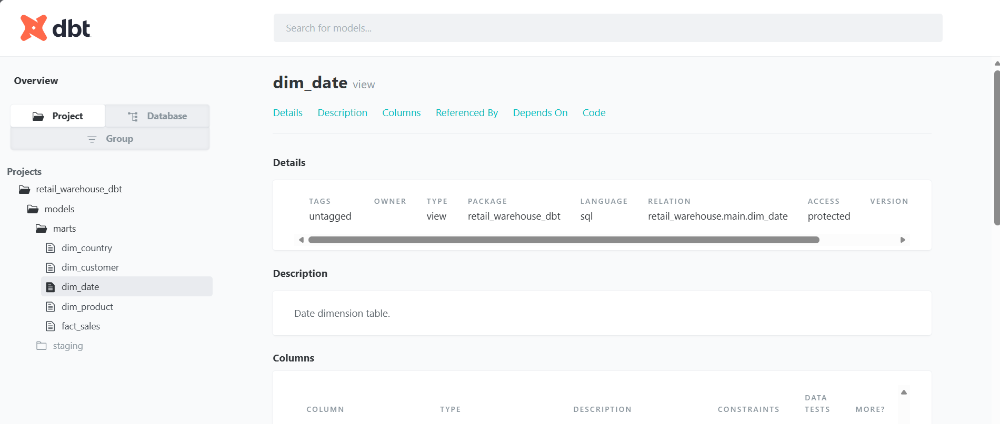

---

### Fact Table

#### Sales Fact Table

The `fact_sales` table stores measurable business events including:
- revenue
- quantity sold
- pricing metrics
- warehouse dimension relationships

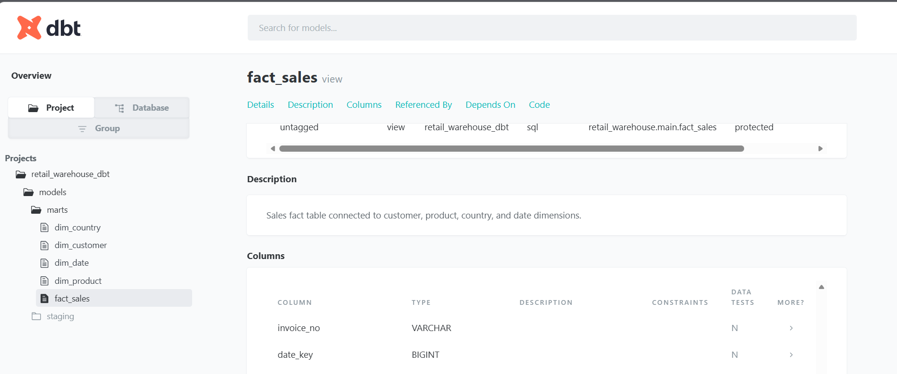

---

## dbt Testing

The project includes automated dbt tests for:

- null validation
- uniqueness validation
- dimension key integrity
- fact table validation

Current dbt validations include:

- `not_null`
- `unique`
- dimension key validation
- fact table integrity testing

Example execution:

```bash
dbt test
```

Example result:

```text
PASS=21 WARN=0 ERROR=0
```

---

## Modern Analytics Engineering Workflow

This project now demonstrates a modern analytics stack workflow:

```text
Raw CSV Data
    ↓
DuckDB Warehouse
    ↓
dbt Transformations
    ↓
Star Schema Modeling
    ↓
Analytics Marts
    ↓
Streamlit Dashboard
```

This architecture reflects real-world analytics engineering practices used with platforms such as:

- Snowflake
- BigQuery
- Redshift
- Databricks

---

## Dashboard Analytics

The Streamlit dashboard provides interactive analytics powered directly from the warehouse models.

### Dashboard Overview

Shows:
- KPI cards
- revenue trends
- customer analytics
- product analytics

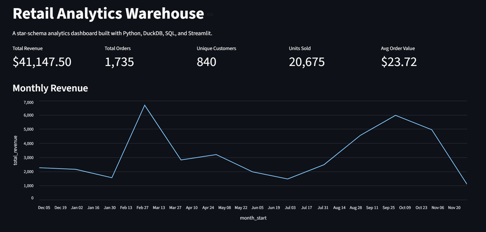

---

### Filter Panel

Users can dynamically filter:
- date range
- country
- products

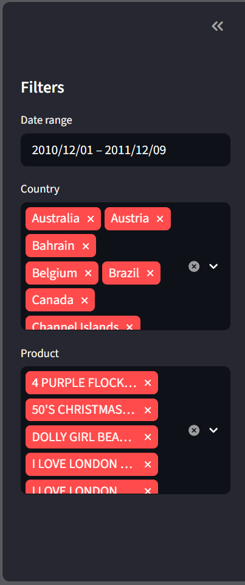

---

### Top Customers

Displays the highest revenue-generating customers.

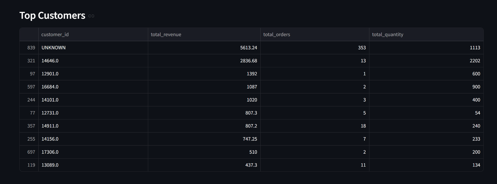

---

### Top Products

Displays the highest-performing products by revenue.

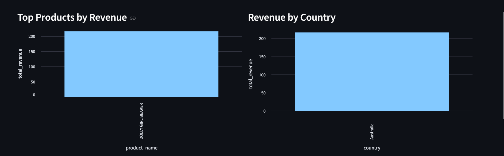

---

### Product Revenue Distribution

Additional product-level analytics visualisation.

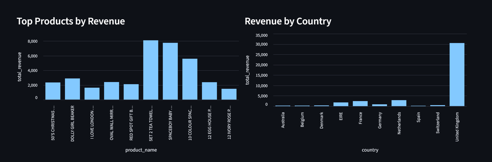

---

### Transaction Details

Detailed transaction-level analytics powered by the warehouse fact table.

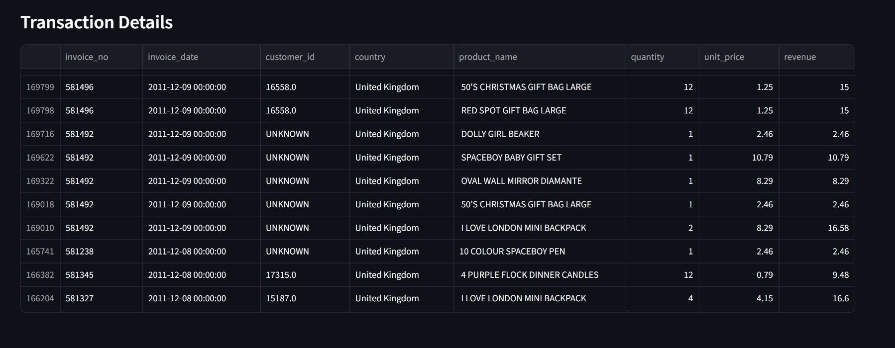
